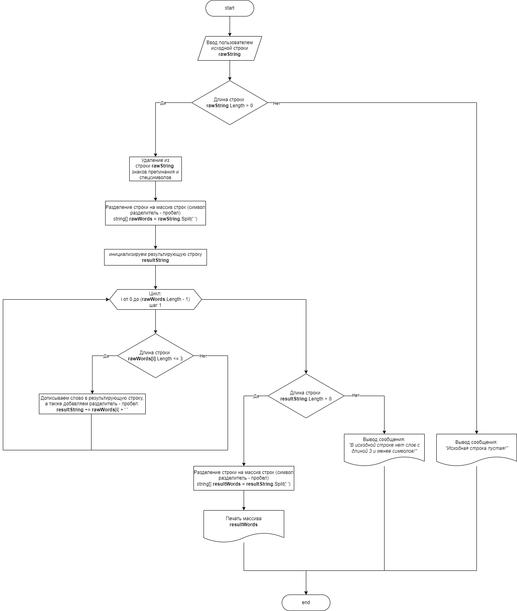

# Описание работы программы:
1. В качестве исходных данных пользователь вводит любую текстовую строку (например, абзац из любой статьи или хотя бы этот readme 😉)
2. Сперва, удаляем из строки скобки, кавычки и знаки препинания.
3. Разбиваем строку на массив строк (слов), разделитель - пробел.

>*Т.к. коллекциями нам пользоваться запретили, то размер результирующего массива мы пока не знаем, а значит будем опять собирать строку из слов, не длиннее 3х символов, которую потом опять разобъем в массив.*

5. Инициализируем пустую текстовую строку, в которую будем записывать результат.
6. Проходим по всему исходному массиву, если длина слова меньше или равна 3, то дописываем её в результирующую строку, а после обязательно добавляем разделитель (пробел).
7. Если в итоге длина строки ненулевая, то разбиваем её на массив. Если нулевая, то сообщаем об этом пользователю.
8. ???
9. **PROFIT!!!!1111** 😀

## Алгоритм программы:
 